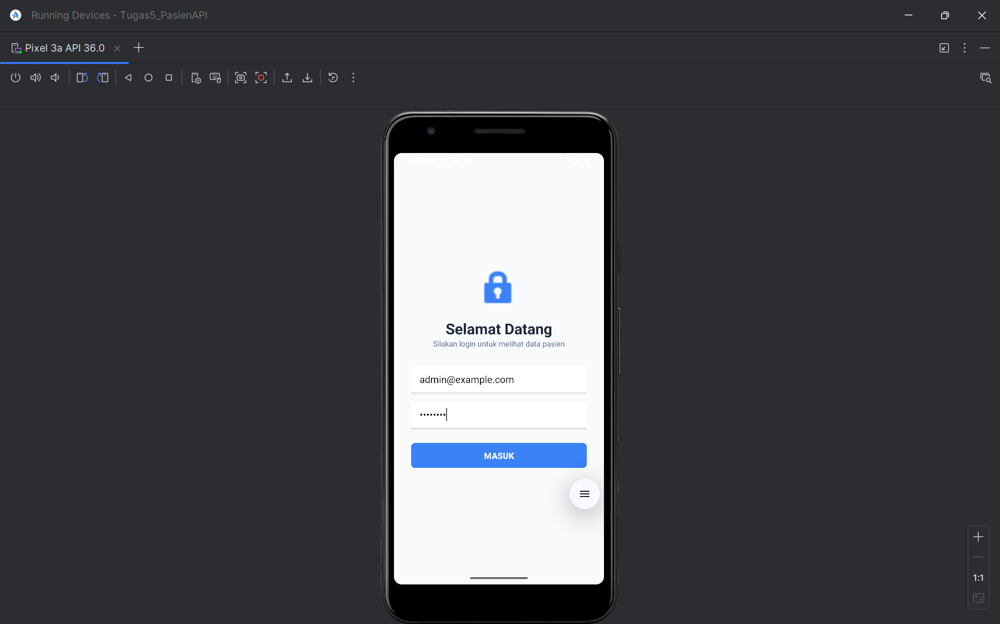
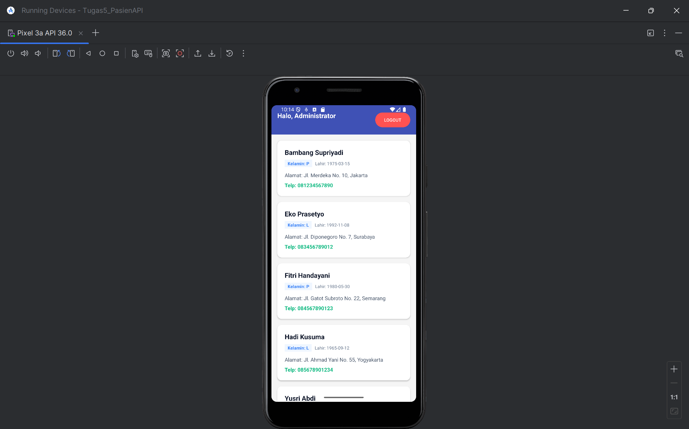

# PasienAPI - Android Kotlin Application 🏥

**PasienAPI** adalah aplikasi Android berbasis Kotlin yang dirancang untuk mengelola data pasien secara real-time melalui integrasi REST API. Proyek ini merupakan pemenuhan **Tugas 5 Mata Kuliah Pemrograman Mobile**, yang berfokus pada penggunaan Retrofit untuk autentikasi dan manajemen data online.

## 📸 Screenshots

Berikut adalah alur penggunaan aplikasi beserta dokumentasi fiturnya:

| **Halaman Login Awal** | **Validasi Input** |
|:---:|:---:|
|  |  |
| *Tampilan awal saat aplikasi dibuka* | *Feedback jika email/password dikosongkan* |

| **Proses Autentikasi** | **Daftar Data Pasien** |
|:---:|:---:|
|  |  |
| *Memasukkan email dan password admin* | *Hasil tarik data dari API menggunakan RecyclerView* |

## ✨ Fitur Utama
- **Login API (Retrofit):** Melakukan request POST ke endpoint `/api/login` untuk mendapatkan akses.
- **Token-Based Authentication:** Menyimpan dan mengirimkan *Bearer Token* di Header Authorization untuk keamanan data.
- **Real-time Data Fetching:** Menarik daftar pasien dari server online secara dinamis.
- **RecyclerView & CardView:** Menampilkan data pasien secara rapi (Nama, Tgl Lahir, Jenis Kelamin, Alamat, dan Telepon).
- **Session Management:** Fitur *Auto-login* menggunakan Shared Preferences sehingga user tidak perlu login berulang kali.
- **UI/UX Robustness:** Penanganan indikator *loading* (ProgressBar) dan pesan *error* (Toast) yang informatif.

## 🛠️ Teknologi yang Digunakan
- **Bahasa:** Kotlin
- **UI Layout:** XML (Views) dengan Material Design 3
- **Networking:** Retrofit 2 & Gson Converter
- **Concurrency:** Kotlin Coroutines & Lifecycle Scope
- **Local Storage:** SharedPreferences (untuk Session Manager)

## 🚀 Cara Menjalankan
1. *Clone* repositori ini:
   ```bash
   git clone [https://github.com/USERNAME-KAMU/Tugas5_PasienAPI.git](https://github.com/USERNAME-KAMU/Tugas5_PasienAPI.git)
